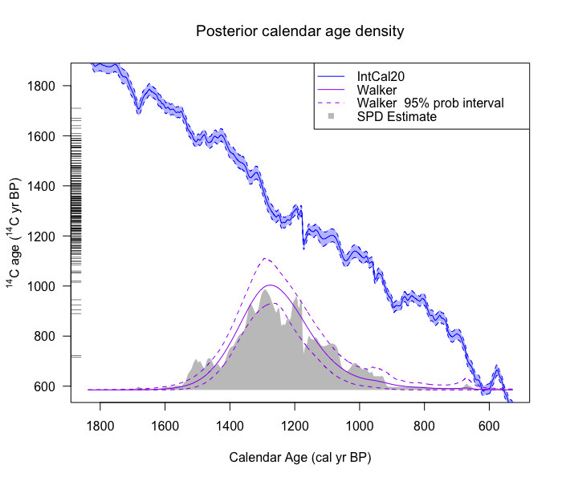

<!-- README.md is generated from README.Rmd. Please edit that file -->

# carbondate

<!-- badges: start -->

[](https://github.com/TJHeaton/carbondate/actions/workflows/R-CMD-check.yaml)
[](https://app.codecov.io/gh/TJHeaton/carbondate?branch=main)
[](https://CRAN.R-project.org/package=carbondate)
<!-- badges: end -->

An R package to analyse multiple radiocarbon determinations. It is based
on the original functions available
[here](https://github.com/TJHeaton/NonparametricCalibration) which were
used for “Non-parametric calibration of multiple related radiocarbon
determinations and their calendar age summarisation”
[arXiv](https://arxiv.org/abs/2109.15024).

## Installation

You can install the development version of carbondate from
[GitHub](https://github.com/) with:

``` r
# install.packages("devtools")
devtools::install_github("TJHeaton/carbondate")
```

## Example

There are 3 example datasets (`kerr`, `buchanan`, `armit`) provided,
which can be used to try out the calibration functions. The calibration
curve IntCal20 is also included in the package. E.g. see below (but note
it is run with a very small number of iterations, this is just for
illustrative purposes.)

``` r
library(carbondate)

walker_temp = WalkerBivarDirichlet(
   c14_determinations = kerr$c14_ages,
   c14_uncertainties = kerr$c14_sig,
   calibration_curve = intcal20,
   lambda = 0.1,
   nu1 = 0.25,
   nu2 = 10,
   alpha_shape = 1,
   alpha_rate = 1)
#>   |                                                                              |                                                                      |   0%  |                                                                              |======================================================================| 100%
```

Once the calibration has been run, the calendar age density can be
plotted. Here instead of plotting the output from the example above, we
plot example output `walker_example_output` which has been run with the
`kerr` data and 10,000 iterations. This example output is also available
as a data set in the package.


