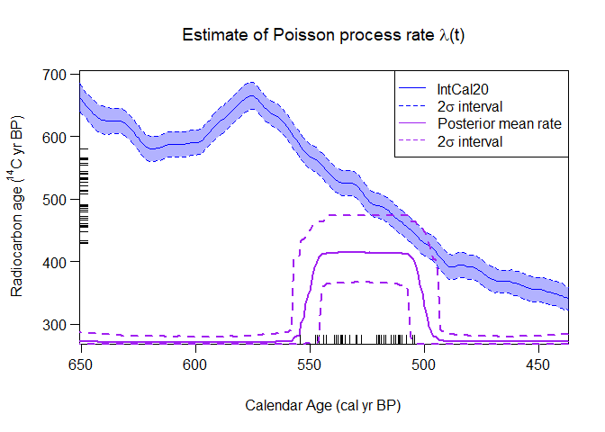

<!-- README.md is generated from README.Rmd. Please edit that file -->

# carbondate

<!-- badges: start -->

[](https://github.com/TJHeaton/carbondate/actions/workflows/R-CMD-check.yaml)
[](https://CRAN.R-project.org/package=carbondate)
<!-- badges: end -->

An R package to analyse, and summarise, multiple radiocarbon
(<sup>14</sup>C) determinations. The package provides two linked (but
distinct) approaches:

- Non-Parametric Density Estimation (a rigorous and robust alternative
  to summed probability distributions)
- Variable Rate Poisson Process Estimation (a linked approach)

It is based partly on the original functions available
[here](https://github.com/TJHeaton/NonparametricCalibration) which were
used for “Non-parametric calibration of multiple related radiocarbon
determinations and their calendar age summarisation” [(Heaton
2022)](https://academic.oup.com/jrsssc/article/71/5/1918/7073284).

## Installation

The easiest way to install it is via CRAN, by typing the following into
your R console:

``` r
install.packages("carbondate")
```

You can alternatively install the development version of carbondate from
[GitHub](https://github.com/) with:

``` r
devtools::install_github("TJHeaton/carbondate")
```

Once you have installed the library with either of the above methods,
you need to load it using:

``` r
library(carbondate)
```

## Data

There are a few example datasets of radiocarbon determinations
(e.g. `two_normals`, `kerr`, `pp_uniform_phase`, `buchanan`) provided,
which can be used to try out the calibration functions. `two_normals` is
a small artificial data set for which the underlying calendar ages were
drawn from a mixture of two normals. It is included simply to give some
quick-to-run examples for the non-parametric calibration functions.
`pp_uniform_phase` is another small artificial dataset which is included
to give quick-to-run examples for the Poisson Process modelling
functions. The remaining datasets are from real-life data. The IntCal
calibration curves and southern hemisphere calibration curves are also
provided.

## Non-parametric calibration quick-start example

The below example calibrates the example data using the IntCal20 curve
via two different methods.

``` r
polya_urn_output <- PolyaUrnBivarDirichlet(
  rc_determinations = two_normals$c14_age,
  rc_sigmas = two_normals$c14_sig,
  calibration_curve=intcal20)

walker_output <- WalkerBivarDirichlet(
  rc_determinations = two_normals$c14_age,
  rc_sigmas = two_normals$c14_sig,
  calibration_curve=intcal20)
```

Once the calibration has been run, the calendar age density can be
plotted.

``` r
PlotPredictiveCalendarAgeDensity(
  output_data = list(polya_urn_output, walker_output),
  show_SPD = TRUE)
```


## Poisson Process modelling quick-start example

The below example models the example data using the IntCal20 curve.

``` r
pp_output <- PPcalibrate(
  rc_determinations = pp_uniform_phase$c14_age,
  rc_sigmas = pp_uniform_phase$c14_sig,
  calibration_curve=intcal20)
```

Once the calibration has been run, the posterior mean rate can be
plotted.

``` r
PlotPosteriorMeanRate(output_data = pp_output)
```


