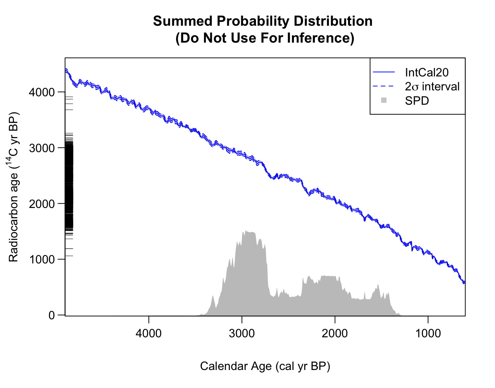
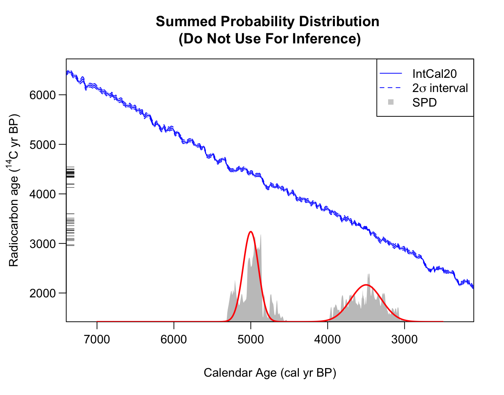
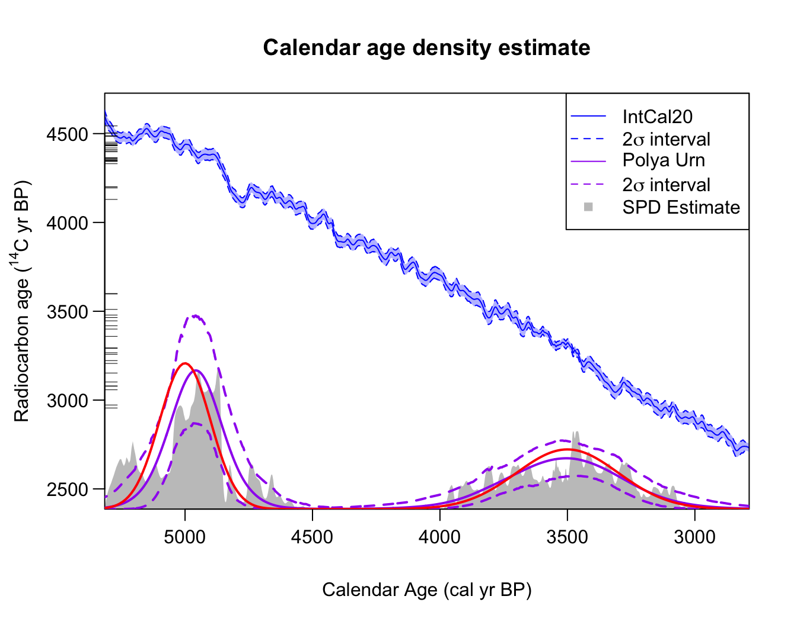

# Why Not to Use SPDs

``` r

library(carbondate)
```

## Summed Probability Distributions

Currently, the most commonly-used approach to summarise calendar age
information from multiple ¹⁴C determinations is to calculate the summed
probability distribution (SPD). However, SPDs provide **neither reliable
nor statistically valid** estimation of the summarised calendar age
information. It is our view that they should not be used in any
dates-as-data approach to provide a population proxy. For complete
details, with comprehensive illustrative examples, on why SPDs should
not be used for summarisation and how they can provide highly misleading
inference, see (Heaton et al. 2025)).

### The Problems with using SPDs

When creating an SPD, the posterior calendar age density of each object
is first calculated independently from the others. These individual
densities are then summed/averaged to give an SPD estimate. The
independence assumed in the initial calibration of each sample, is
fundamentally contradictory to the subsequent summarisation and results
in a calendar age summary that is both unreliable and inconsistent.

Additionally, the SPD approach fundamentally does not model the samples
in the calendar age domain. Consequently, it is also not able to deal
with inversions in the calibration curve where there are multiple
disjoint calendar periods which are consistent with the observed
determinations; or with plateau periods.

The SPD function is **ONLY** provided here as a comparison with the
other routines. To calculate the SPD for a set of radiocarbon
determinations (here we use the example dataset `armit` (Armit et al.
2014)) see the example below, where we also plot the results.

``` r

spd <- FindSummedProbabilityDistribution(
  calendar_age_range_BP = c(1000, 4500), 
  rc_determinations = armit$c14_age, 
  rc_sigmas = armit$c14_sig, 
  F14C_inputs = FALSE, 
  calibration_curve = intcal20,
  plot_output = TRUE)
```



**Note:** The functions we provide to plot the rigorous calendar age
summary provided by our Bayesian non-parametric DPMM alternative to SPDs
can also optionally plot the SPD - see the vignette [Non-parametric
Calendar Age
Summarisation](https://tjheaton.github.io/carbondate/articles/Non-parametric-summed-density.md)
for details.

### Illustration of why not to use SPDs

#### Fitting to a mixture of two normal distributions

The `two_normals` dataset contains 50 simulated ¹⁴C determinations.
These were created by first drawing a set of 50 calendar ages from a
mixture of two normal calendar age densities - one centred at 3500 cal
yr BP (with a 1$`\sigma`$ standard deviation of 200 cal yrs); and
another (more concentrated) centred at 5000 cal yr BP (with a
1$`\sigma`$ standard deviation of 100 cal yrs). Having simulated these
calendar ages, a corresponding ¹⁴C determination for each sample were
created using the IntCal20 curve (Reimer et al. 2020).

When we summarise the calendar age information provided by the 50
simulated ¹⁴C determinations, we would aim to reconstruct the underying
mixture of two normals that were used to generate the data. However,
when we calculate the SPD we obtain:



Here we have manually overlain the true (in this case, known) shared
calendar age density in red. As we can see, the SPD captures does
capture some broad features of that underlying calendar age distribution
but does not reconstruct the truth well, and is hard to interpret. In
particular, the SPD is highly variable, showing multiple peaks, due to
the wiggliness of the calibration curve. The SPD peak shown around 5300
cal yr BP is entirely spurious, yet almost of the same magnitude as its
peak around 3500 cal yr BP (which is a part of the genuine density).

### An improvement using our library approaches

While this is jumping forward somewhat, to evidence that our methods
provide better reconstructions, we run the same example using our
Bayesian non-parametric summarisation approach (shown in purple as
*Polya Urn*) and obtain:



## References

Armit, Ian, Graeme T. Swindles, Katharina Becker, Gill Plunkett, and
Maarten Blaauw. 2014. “Rapid Climate Change Did Not Cause Population
Collapse at the End of the European Bronze Age.” *Proceedings of the
National Academy of Sciences* 111 (48): 17045–49.
<https://doi.org/10.1073/pnas.1408028111>.

Heaton, Timothy J., Sara Al-assam, and Edouard Bard. 2025. “A new
approach to radiocarbon summarisation: Rigorous identification of
variations/changepoints in the occurrence rate of radiocarbon samples
using a Poisson process.” *Journal of Archaeological Science* 182:
106237. https://doi.org/<https://doi.org/10.1016/j.jas.2025.106237>.

Reimer, Paula J, William E N Austin, Edouard Bard, et al. 2020. “The
IntCal20 Northern Hemisphere Radiocarbon Age Calibration Curve (0–55 cal
kBP).” *Radiocarbon* 62 (4): 725–57.
<https://doi.org/10.1017/rdc.2020.41>.
