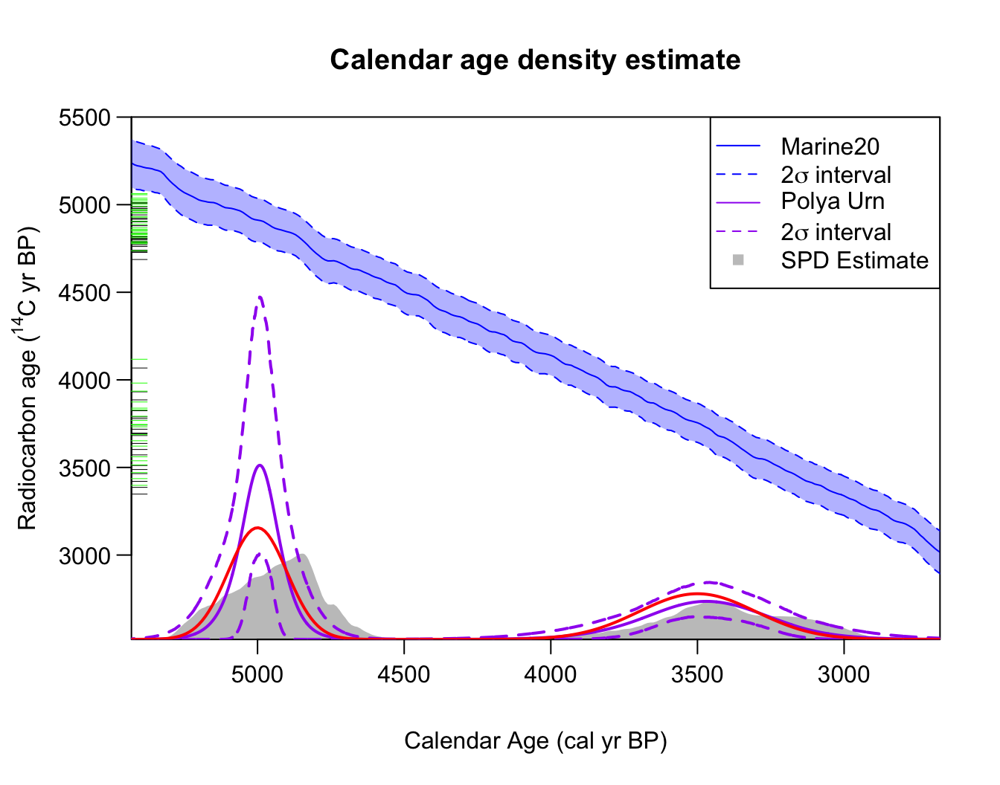
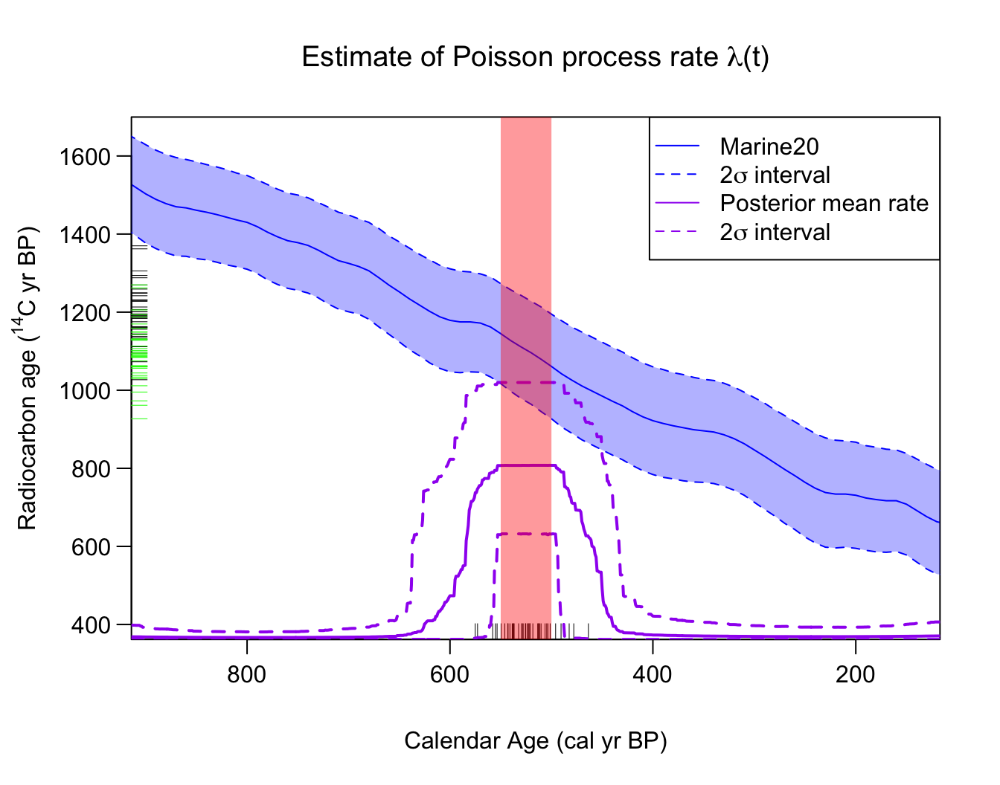
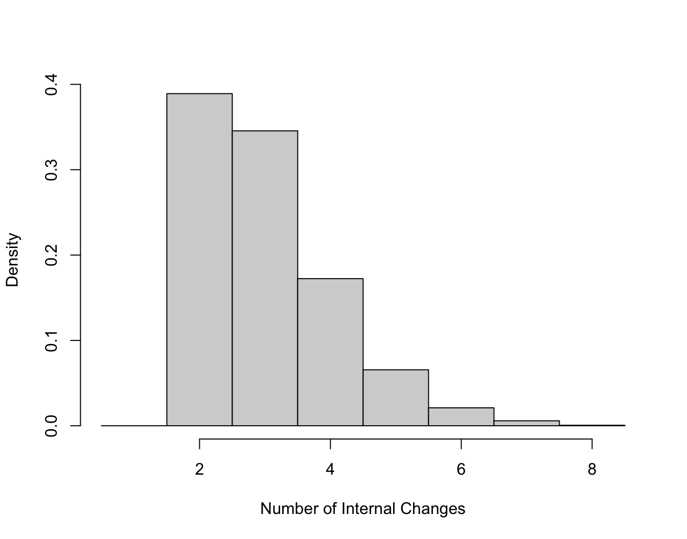
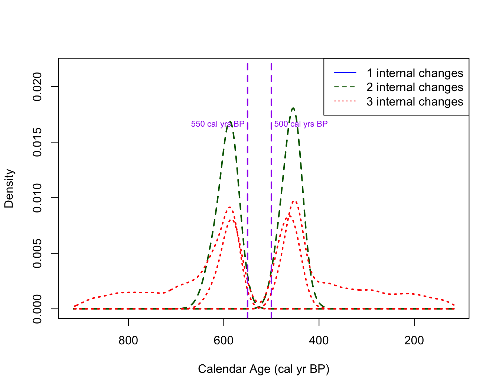
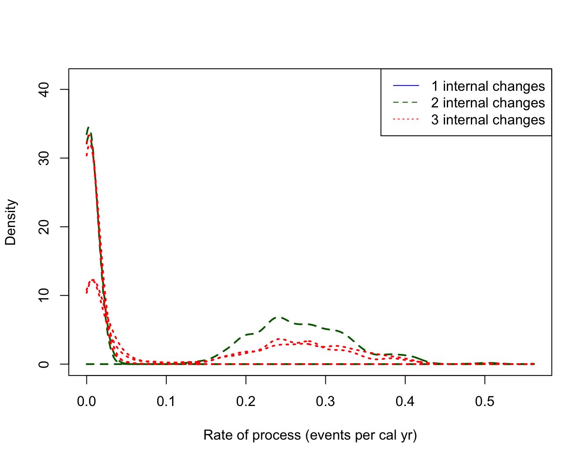

# Calibrating and Summarising Marine 14C Samples

``` r

library(carbondate)
set.seed(15)
```

## Calibrating Marine ¹⁴C Determinations with a $`\Delta R`$

It is possible to calibrate and summarise marine $`^{14}`$C
determinations within the library. Marine $`^{14}`$C determinations are
slightly more complex to calibrate since they require a localised
$`\Delta R`$ adjustment before calibration against the Marine20
calibration curve, see Heaton et al. (2023) for details on marine
calibration and Heaton et al. (2020) for the Marine20 calibration curve.

*Note:* You must use the specific $`\Delta R`$ adjustment appropriate
for the particular marine calibration curve you are using for
calibration (as the estimates of $`\Delta R`$ change each time the
marine calibration curve is updated). The most recent estimates
$`\Delta R_{20}`$, calculated based on the Marine20 calibration curve,
can be found at <http://calib.org/marine/>

### Calibrating a Single Marine ¹⁴C Sample

As described in the [independent calibration
vignette](https://tjheaton.github.io/carbondate/articles/Independent-calibration.md),
we can calibration an individual marine $`^{14}`$C sample in
[`CalibrateSingleDetermination()`](https://tjheaton.github.io/carbondate/reference/CalibrateSingleDetermination.md)
by specifying the inbuilt `marine20` calibration curve (Heaton et al.
2020), and providing an estimate for the localised $`\Delta R`$ (and its
$`1\sigma`$-uncertainty by specifying `delta_r` and `delta_r_sig`:

``` r

calibration_result <- CalibrateSingleDetermination(
  rc_determination = 1413, 
  rc_sigma = 25, 
  F14C_inputs = FALSE, 
  calibration_curve = marine20,
  delta_r = 150,
  delta_r_sig = 50, 
  plot_output = TRUE)
```


Here the radiocarbon age axis shows the analytical ¹⁴C determination in
red, while the adjusted determination (after applying a
$`\Delta R = 150 \pm 50`$¹⁴C yrs) is shown in green. Intuitively, we
calibrate the green (adjusted) value against the Marine20 curve.

**Note:** One can also use the `delta_r` and `delta_r_sig` arguments to
specify a general offset to a calibration curve (i.e., these arguments
can also be used when using the IntCal and SHCal curves if the samples
is thought to be offset).

### Non-parametric Calendar Age Summarisation from a Set of Marine ¹⁴C Samples

If we have a set of marine ¹⁴C samples which share a common $`\Delta R`$
then we can use the
[`PolyaUrnBivarDirichlet()`](https://tjheaton.github.io/carbondate/reference/PolyaUrnBivarDirichlet.md)
or
[`WalkerBivarDirichlet()`](https://tjheaton.github.io/carbondate/reference/WalkerBivarDirichlet.md)
functions to obtain a non-parametric DPMM summary of the joint
(predictive) calendar age distribution. To do this we specify the value
of $`\Delta R`$ and uncertainty as additional arguments, and state that
we wish to use the marine radiocarbon calibration curve.

#### Worked Example - A Marine Mixture of Two Normals

We consider the artificial `two_normals_marine` dataset which contains
50 simulated marine ¹⁴C samples. This dataset is analogous to the
atmospheric `two_normals` but the ¹⁴C determinations are instead sampled
from the marine environment.  
Specifically, the `two_normals_marine` dataset was created by first
drawing 50 calendar ages from a mixture of two normal densities - one
centred at 3500 cal yr BP (with a 1$`\sigma`$ standard deviation of 200
cal yrs); and another (more concentrated) centred at 5000 cal yr BP
(with a 1$`\sigma`$ standard deviation of 100 cal yrs). The
corresponding 50 $`^{14}`$C determinations are then simulated using the
Marine20 calibration curve (Heaton et al. 2020) with an assumed
$`\Delta R_{20}`$ of $`-50 \pm 30\,`$$`^{14}`$C yrs. The analytical
measurement uncertainty of each determination is set to be 25 $`^{14}`$C
yrs.

We wish to investigate if we can reconstruct the underlying mixture of
two normals calendar age distribution, from just the $`^{14}`$C values.
For example, if we use the *recommended* Polya Urn approach:

``` r

polya_urn_output <- PolyaUrnBivarDirichlet(
  rc_determinations = two_normals_marine$c14_age, 
  rc_sigmas = two_normals_marine$c14_sig, 
  calibration_curve = marine20, 
  delta_r = -50, 
  delta_r_sig = 30)

polya_DPMM_plot <- PlotPredictiveCalendarAgeDensity(
  output_data = polya_urn_output,
  show_SPD = TRUE)
```

*Note:*
Here we have also shown the underlying calendar age distribution,
consisting of a mixture of two normals, that was used for simulating the
data in red.

### Poisson process rate estimation from a set of marine ¹⁴C samples

If we have a set of marine ¹⁴C samples which share a common $`\Delta R`$
then we can use the
[`PPcalibrate()`](https://tjheaton.github.io/carbondate/reference/PPcalibrate.md)
function, specifying the value of $`\Delta R`$ and its corresponding
uncertainty as additional arguments, and stating we wish to use the
marine radiocarbon calibration curve.

#### Example - Uniform Phase Marine Data

The dataset `pp_uniform_phase_marine` contains 40 simulated marine ¹⁴C
samples with underlying calendar ages that have been sampled uniformly
from the calendar period from \[550, 500\] cal yr BP. The corresponding
$`^{14}`$C determinations are then simulated based upon the Marine20
calibration curve with an assumed $`\Delta R_{20}`$ of
$`100 \pm 20\,`$$`^{14}`$C yrs. The analytical measurement uncertainty
of each determination is set to be 15 $`^{14}`$C yrs. Effectively, this
example is analogous to the atmospheric dataset `pp_uniform_phase` but
the determinations are instead sampled from the marine environment.

We wish to investigate if we can reconstruct the underlying uniform
phase calendar age distribution, from just the $`^{14}`$C values.

``` r

# Fit the Poisson process model to marine 14C data
PP_fit_output_marine <- PPcalibrate(
    rc_determinations = pp_uniform_phase_marine$c14_age,
    rc_sigmas = pp_uniform_phase_marine$c14_sig,
    calibration_curve = marine20,
    delta_r = 100, 
    delta_r_sig = 20,
    n_iter = 1e5,
    show_progress = FALSE)

# Plot the posterior mean rate
posterior_mean_marine_plot <- PlotPosteriorMeanRate(PP_fit_output_marine)

# Add shading to show the period from which the underlying data were sampled
AddShadingPlot(posterior_mean_marine_plot,
    x_start = 550, x_end = 500,
    col = "red")
```


Here, on the radiocarbon age axis, we show the observed $`^{14}`$C
marine determinations in black, and the adjusted determinations (after
applying a $`\Delta R = 100 \pm 20`$¹⁴C yrs) are shown in green.
Intuitively, we jointly calibrate and summarise the green (adjusted)
values against the Marine20 curve.

In this example, we can see that the Poisson process summarisation still
provides a posterior estimate for the sample occurrence rate that is
consistent with the true (simulated) uniform phase \[550, 500\] cal yr
BP calendar age distribution. The times of the changepoints are however
less certain and can extend beyond this short 50 cal yr period (see also
the plot of changepoint locations shown below). This is perhaps to be
expected since the Marine20 curve is less precise and so a broader range
of calendar ages are consistent with the simulated ¹⁴C data.

We can also access the estimated posterior mean rate

``` r

# Access the actual posterior
posterior_marine_rate <- posterior_mean_marine_plot$posterior_rate
head(posterior_marine_rate)
#>   calendar_age_BP   rate_mean rate_ci_lower rate_ci_upper
#> 1             117 0.005500639  2.686674e-05    0.02765431
#> 2             118 0.005500892  2.686674e-05    0.02765431
#> 3             119 0.005496691  2.686674e-05    0.02765431
#> 4             120 0.005496139  2.686674e-05    0.02765431
#> 5             121 0.005467455  2.686674e-05    0.02765431
#> 6             122 0.005467455  2.686674e-05    0.02765431
```

#### Plotting the number of changepoints and their locations

The object `PP_fit_output_marine` can also be accessed directly or used
with the other in-built plotting functions just as if the underpinning
$`^{14}`$C data were atmospheric, for example, we can access the
posterior estimate of the number of changepoints:

``` r

PlotNumberOfInternalChanges(PP_fit_output_marine)
```



and the posterior estimate of the location of those changepoints
(conditional on their number):

``` r

posterior_changepoint_marine_plot <- PlotPosteriorChangePoints(PP_fit_output_marine)
#> Warning in PlotPosteriorChangePoints(PP_fit_output_marine): No posterior
#> samples with 1 internal changes

# Add lines to show the times of the changepoints in
# the underlying distribution from which the data were 
# simulated at 500 and 550 cal yr BP
AddLinePlot(
     posterior_changepoint_marine_plot,
     v = 550,
     col = "purple",
     lwd = 2,
     lty = 2)

AddLinePlot(
     posterior_changepoint_marine_plot,
     v = 500,
     col = "purple",
     lwd = 2,
     lty = 2)

AddTextPlot(posterior_changepoint_marine_plot,
    x = 550, y = 0.0165,
    labels = expression(paste("550 cal yrs BP")),
    cex = 0.7,
    pos = 2,
    offset = 0.2,
    col = "purple")

AddTextPlot(posterior_changepoint_marine_plot,
    x = 500, y = 0.0165,
    labels = expression(paste("500 cal yrs BP")),
    cex = 0.7,
    pos = 4,
    offset = 0.2,
    col = "purple")
```


We can also plot the heights (i.e. rates) in each interval

``` r

posterior_heights_marine_plot <- PlotPosteriorHeights(PP_fit_output_marine)
#> Warning in PlotPosteriorHeights(PP_fit_output_marine): No posterior samples
#> with 1 internal changes
```



### References

Heaton, T J, E Bard, C Bronk Ramsey, et al. 2023. “A Response to
Community Questions on the Marine20 Radiocarbon Age Calibration Curve:
Marine Reservoir Ages and the Calibration of 14C Samples from the
Oceans.” *Radiocarbon* 65 (1): 247–73.
<https://doi.org/10.1017/RDC.2022.66>.

Heaton, Timothy J, Peter Köhler, Martin Butzin, et al. 2020. “Marine20 —
The Marine Radiocarbon Age Calibration Curve (0–55,000 cal BP).”
*Radiocarbon* 62 (4): 779–820. <https://doi.org/10.1017/RDC.2020.68>.
