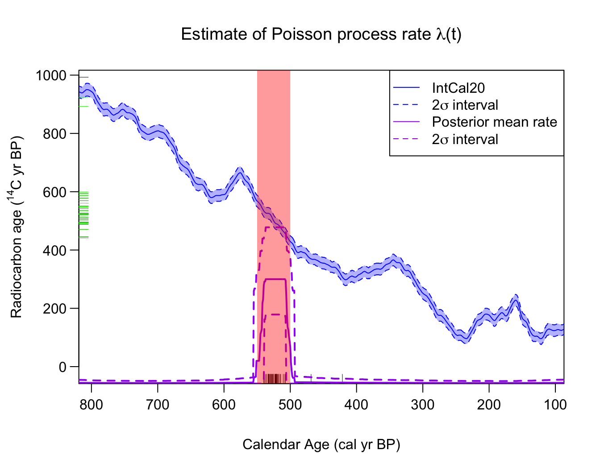
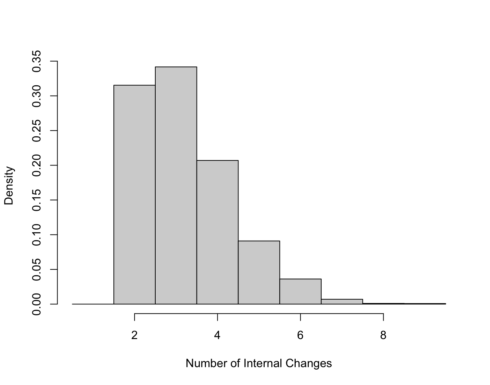
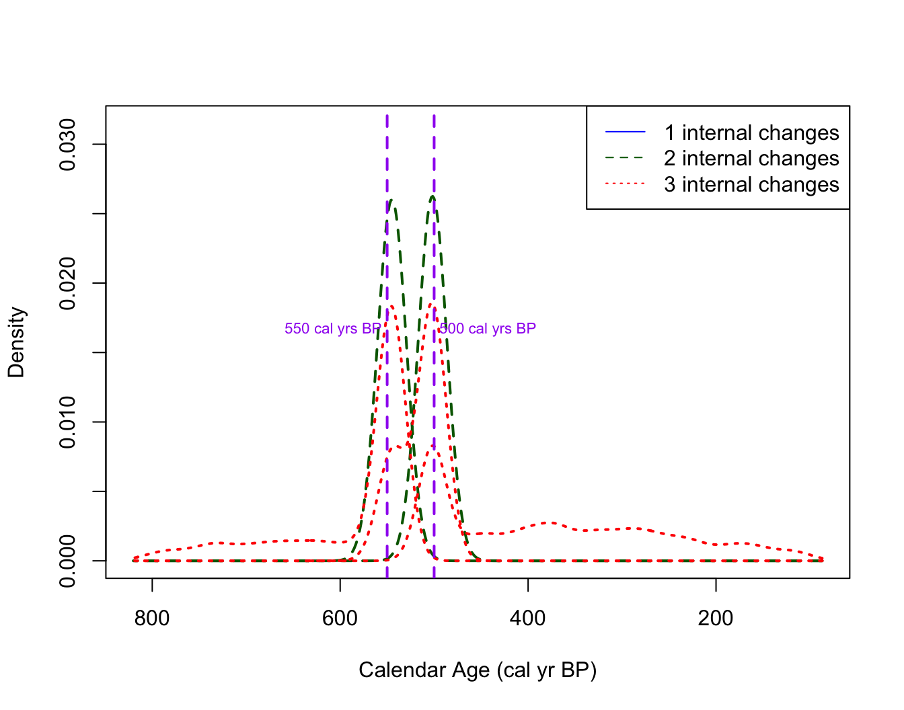
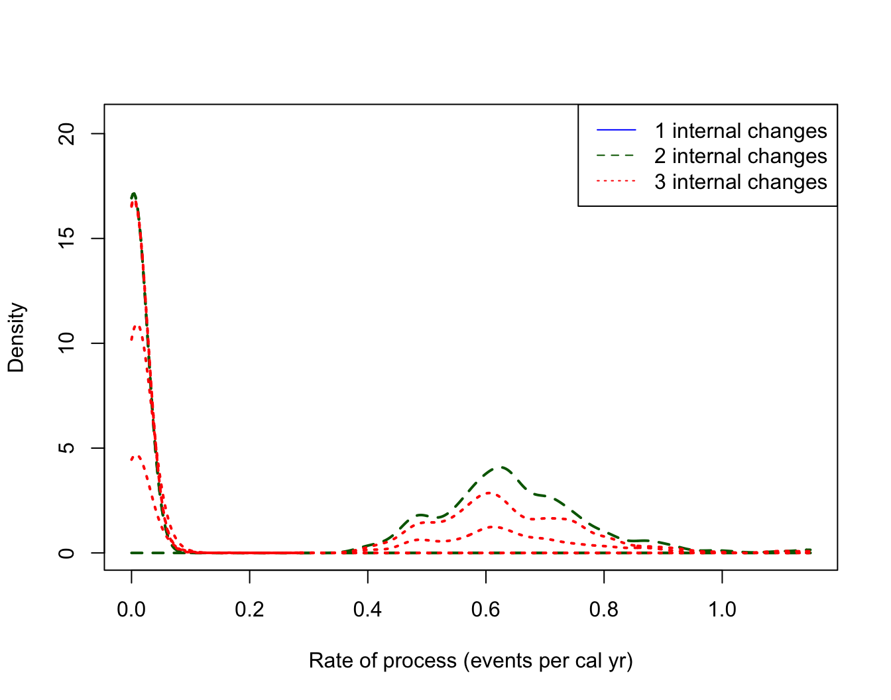

# Calibrating and Summarising Mixed Sets of 14C Samples

``` r

library(carbondate)
set.seed(15)
```

## Calibrating sets of ¹⁴C samples from mixed environments

### Poisson process calibration

To summarise sets of $`^{14}`$C determinations from mixed environments
(i.e. samples that require calibrating against multiple calibration
curves such as IntCal20, SHCal20, and Marine20) using a Poisson process,
then you need to use the
[`PPcalibrateMixedCurves()`](https://tjheaton.github.io/carbondate/reference/PPcalibrateMixedCurves.md)
function. As well as providing the ¹⁴C determinations, this requires you
to specify several additional variables:

- `sample_source` A character vector containing `"NH"`, `"SH"` and
  `"Marine"` dependent upon the environment of each sample in the set.
  This will determine if the sample will be calibrated against IntCalXX
  (`"NH"`), SHCalXX (`"SH"`), and MarineXX (`"Marine"`) where XX denotes
  the curve year. This vector must be the same length as the number of
  ¹⁴C determinations.
- `curve_year` One of `"2020"`, `"2013"`, `"2009"` or `"2004"`
  specifying the calibration curve year to use for calibration. Make
  sure you use the $`\Delta R`$ that is appropriate to the calibration
  curve. The default is to choose `"2020"`.
- `delta_r` A vector of the $`\Delta R`$ offset for each specific ¹⁴C
  sample. For atmospheric samples (i.e. `"NH"` or `"SH"` samples) select
  `0` unless you want to model them as offset from the relevant IntCal
  or SHCal curve.
- `delta_r_sig` A vector of the and associated $`1\sigma`$ uncertainty
  on $`\Delta R`$ for each sample. Again, for atmospheric samples,
  select `0` unless you have modelled them as offset from the relevant
  curve.

See Reimer et al. (2020) for more information on the IntCal20 curve,
Hogg et al. (2020) for the SHCal20 curve, and Heaton et al. (2020) for
the Marine20 curve.

#### Example - Uniform Phase Mixed Data

The dataset `pp_uniform_phase_mixed` contains 40 simulated ¹⁴C samples
from a range of environments. All the samples have underlying calendar
ages that have been sampled uniformly from the calendar period from
\[550, 500\] cal yr BP but some are assumed to come from the Northern
Hemisphere (NH - 14 samples), others from the Southern Hemisphere (SH -
14 samples) and others from a range of Marine surface-ocean environments
(Marine - 12 samples).

The corresponding $`^{14}`$C determinations for each sample are
simulated according to the relevant calibration curve for that
environment (IntCal20, SHCal20 and Marine20); and the marine data have a
range of different $`\Delta R`$ values (i.e. represent different ocean
regions). The analytical measurement uncertainty of each determination
is set to be 15 $`^{14}`$C yrs.

We wish to investigate if we can reconstruct the underlying calendar age
distribution, a uniform phase \[550, 500\] cal yr BP, from which the
samples were simulated based only on the set of 40 $`^{14}`$C values.

``` r

# Fit the Poisson process model to a sert of data from different environments
PP_fit_output_mixed <- PPcalibrateMixedCurves(
    rc_determinations = pp_uniform_phase_mixed$c14_age,
    rc_sigmas = pp_uniform_phase_mixed$c14_sig,
    sample_source = pp_uniform_phase_mixed$sample_source,
    curve_year = "2020",
    delta_r = pp_uniform_phase_mixed$delta_r,
    delta_r_sig = pp_uniform_phase_mixed$delta_r_sig,
    show_progress = FALSE)

# Plot the posterior mean rate
posterior_mean_mixed_plot <- PlotPosteriorMeanRate(PP_fit_output_mixed)
#> Warning in graphics::rug(rc_determinations, side = 2): some values will be
#> clipped
#> Warning in graphics::rug(adjusted_values$rc_determination, side = 2, col =
#> delta_r_adjusted_colour): some values will be clipped

# Add shading to show the period from which the underlying data were sampled
AddShadingPlot(posterior_mean_mixed_plot,
    x_start = 550, x_end = 500,
    col = "red")
```



Here, on the radiocarbon age axis, we show as the observed $`^{14}`$C
determinations as black ticks, and the $`\Delta R`$ adjusted
determinations as green ticks. For many samples (i.e. those from the SH
or NH) they are the same and so only the green ticks are visible. To
keep the plot tidy, we show just the IntCal curve (even though some of
the samples are calibrated against the SHCal or Marine curve).

We can see that the Poisson process summarisation provides a posterior
estimate for the sample occurrence rate that accurately reconstructs the
true (simulated) uniform phase \[550, 500\] cal yr BP calendar age
distribution.

We can also access the estimated posterior mean rate

``` r

# Access the actual posterior
posterior_mixed_rate <- posterior_mean_mixed_plot$posterior_rate
head(posterior_mixed_rate)
#>   calendar_age_BP   rate_mean rate_ci_lower rate_ci_upper
#> 1              87 0.005176997   0.000179203    0.02472772
#> 2              88 0.005176997   0.000179203    0.02472772
#> 3              89 0.005176997   0.000179203    0.02472772
#> 4              90 0.005164320   0.000179203    0.02428469
#> 5              91 0.005169130   0.000179203    0.02428469
#> 6              92 0.005158710   0.000179203    0.02424438
```

#### Plotting the number of changepoints and their locations

The object `PP_fit_output_mixed` can also be accessed directly or used
with the other in-built plotting functions just as with output from
[`PPcalibrate()`](https://tjheaton.github.io/carbondate/reference/PPcalibrate.md),
for example, we can access the posterior estimate of the number of
changepoints:

``` r

PlotNumberOfInternalChanges(PP_fit_output_mixed)
```



and the posterior estimate of the locations of those changepoints
(conditional on their number):

``` r

posterior_changepoint_mixed_plot <- PlotPosteriorChangePoints(PP_fit_output_mixed)
#> Warning in PlotPosteriorChangePoints(PP_fit_output_mixed): No posterior samples
#> with 1 internal changes

# Add lines at 500 and 550 cal yr BP 
# (the "true" changepoints in the simulation)
AddLinePlot(
     posterior_changepoint_mixed_plot,
     v = 550,
     col = "purple",
     lwd = 2,
     lty = 2)

AddLinePlot(
     posterior_changepoint_mixed_plot,
     v = 500,
     col = "purple",
     lwd = 2,
     lty = 2)

AddTextPlot(posterior_changepoint_mixed_plot,
    x = 550, y = 0.0165,
    labels = expression(paste("550 cal yrs BP")),
    cex = 0.7,
    pos = 2,
    offset = 0.2,
    col = "purple")

AddTextPlot(posterior_changepoint_mixed_plot,
    x = 500, y = 0.0165,
    labels = expression(paste("500 cal yrs BP")),
    cex = 0.7,
    pos = 4,
    offset = 0.2,
    col = "purple")
```


We can also plot the heights (i.e. rates) in each interval

``` r

posterior_heights_mixed_plot <- PlotPosteriorHeights(PP_fit_output_mixed)
#> Warning in PlotPosteriorHeights(PP_fit_output_mixed): No posterior samples with
#> 1 internal changes
```



### Non-Parametric (DPMM) Summarisation - TBC

This functionality is still to be added (watch this space)

### References

Heaton, Timothy J, Peter Köhler, Martin Butzin, et al. 2020. “Marine20 —
The Marine Radiocarbon Age Calibration Curve (0–55,000 cal BP).”
*Radiocarbon* 62 (4): 779–820. <https://doi.org/10.1017/RDC.2020.68>.

Hogg, Alan G, Timothy J Heaton, Quan Hua, et al. 2020. “SHCal20 Southern
Hemisphere Calibration, 0–55,000 Years cal BP.” *Radiocarbon* 62 (4):
759–78. <https://doi.org/10.1017/RDC.2020.59>.

Reimer, Paula J, William E N Austin, Edouard Bard, et al. 2020. “The
IntCal20 Northern Hemisphere Radiocarbon Age Calibration Curve (0–55 cal
kBP).” *Radiocarbon* 62 (4): 725–57.
<https://doi.org/10.1017/rdc.2020.41>.
