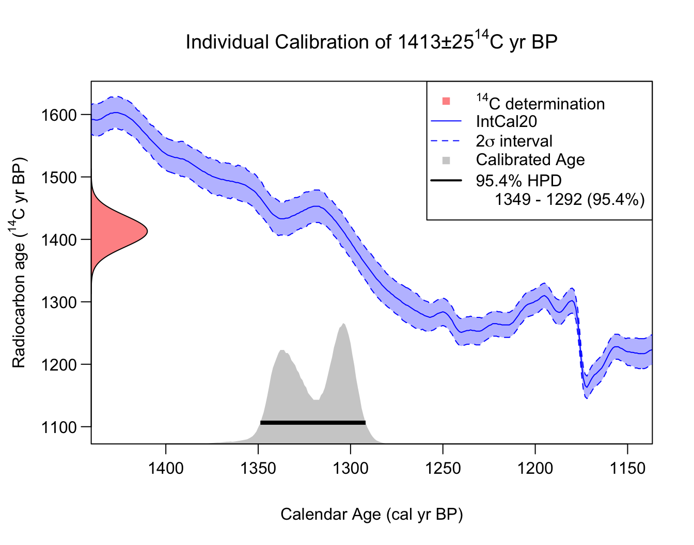
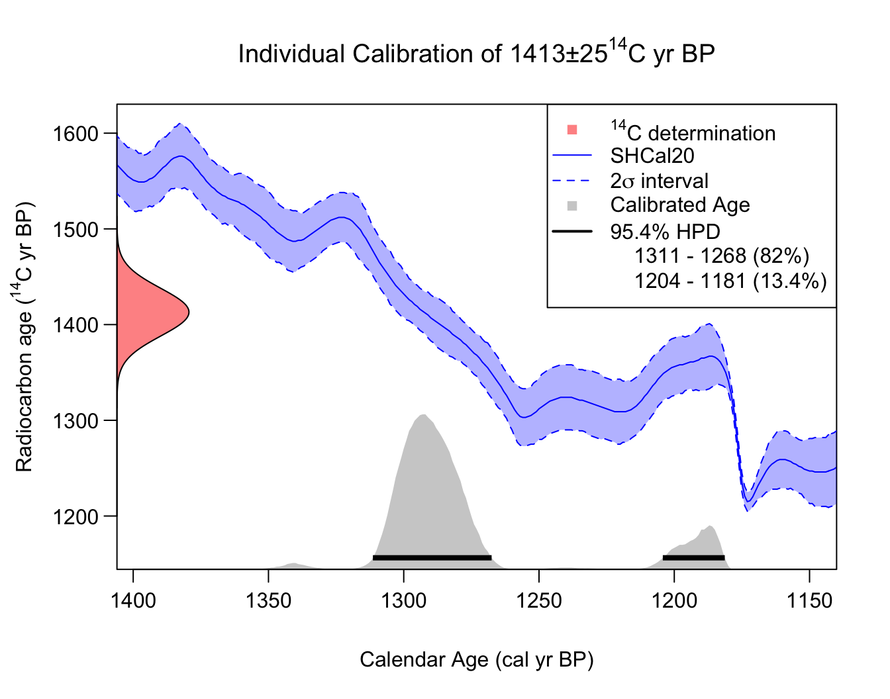
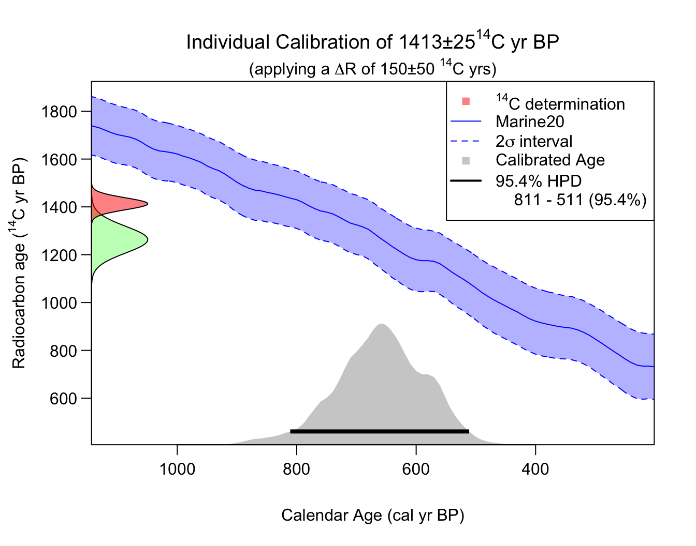
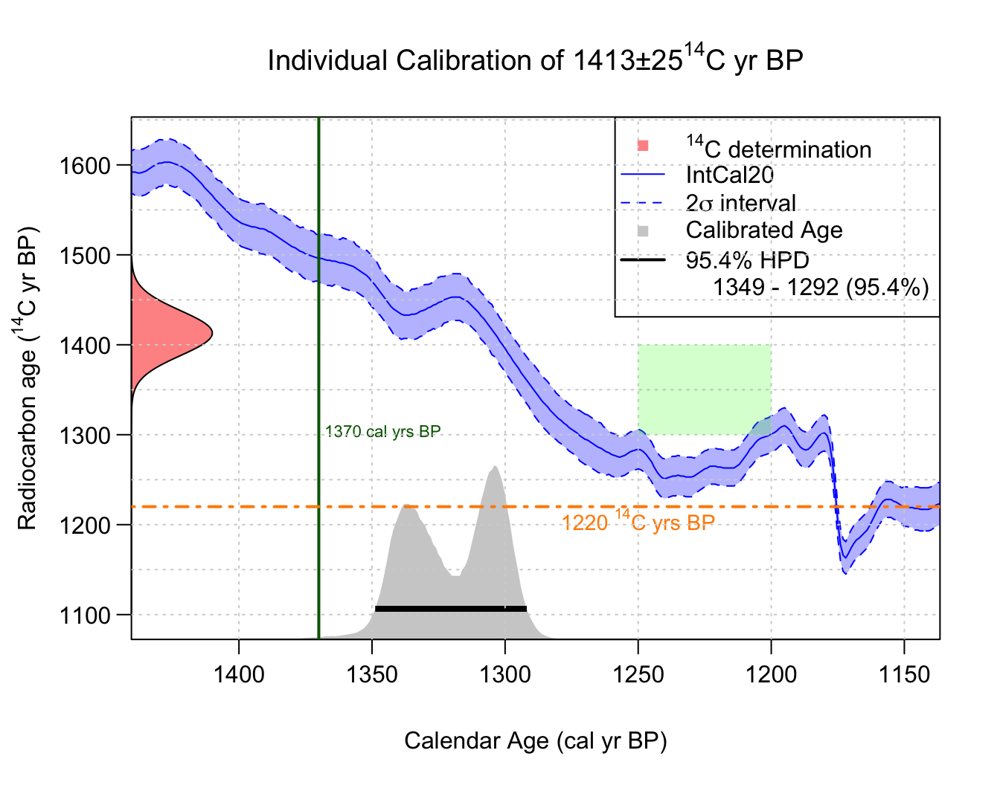

# Independent Single Sample Calibration

``` r

library(carbondate)
```

## Introduction

This package is primarily concerned with the calibration, and
summarisation, of multiple related ¹⁴C determinations. With such a set
of samples, which are believed to arise from a common calendar
distribution related to the culture/context under study, the calibration
of those samples should be performed jointly. This will allow calendar
age information to be shared between the samples during the calibration
process leading to improved overall calibration accuracy. It also allows
us to combine and summarise the calendar age information provided by the
entire set.

However, our library also provides functions for calibrating a single
¹⁴C sample independently. This can be useful if one does only have a
single ¹⁴C sample, or to provide comparison with the joint calibration
approaches.

### Independent Calibration of Single ¹⁴C Samples

To calibrate a single independent determination using the provided
IntCal20 calibration curve (Reimer et al. 2020), run the following:

``` r

calibration_result <- CalibrateSingleDetermination(
  rc_determination = 1413, 
  rc_sigma = 25, 
  F14C_inputs = FALSE, 
  calibration_curve = intcal20,
  plot_output = TRUE)
```



#### Implementing SH calibration

To change to using the Southern Hemisphere calibration curve SHCal20
(Hogg et al. 2020), we can modify the function arguments accordingly:

``` r

calibration_result <- CalibrateSingleDetermination(
  rc_determination = 1413, 
  rc_sigma = 25, 
  F14C_inputs = FALSE, 
  calibration_curve = shcal20,
  plot_output = TRUE)
```



**Note:** This simulated SH calibration, of the same ¹⁴C determination
as above, provides a slightly more recent estimate for the calendar due
to the offset (the interhemispheric ¹⁴C gradient) between atmospheric
¹⁴C levels in the Southern and Northern Hemisphere.

#### Implementing Marine calibration

To change to using the Marine20 calibration curve (Heaton et al. 2020),
we can alter the argument to select the inbuilt `marine20` curve. To
perform marine calibration, we must also provide an estimate for the
localised $`\Delta R`$ (and its $`1\sigma`$-uncertainty) by specifying
`delta_r` and `delta_r_sig`:

``` r

calibration_result <- CalibrateSingleDetermination(
  rc_determination = 1413, 
  rc_sigma = 25, 
  F14C_inputs = FALSE, 
  calibration_curve = marine20,
  delta_r = 150,
  delta_r_sig = 50, 
  plot_output = TRUE)
```



Here the radiocarbon age axis shows the analytical ¹⁴C determination in
red, while the adjusted determination (after applying a
$`\Delta R = 150 \pm 50`$¹⁴C yrs) is shown in green. Intuitively, we
calibrate the green (adjusted) value against the Marine20 curve.

**Note:** One can also use the `delta_r` and `delta_r_sig` arguments to
specify a general offset to a calibration curve (i.e., these arguments
can also be used when using the IntCal and SHCal curves if the sample is
thought to be offset).

### Selecting the calendar age scale when plotting

All the calibration curves, and the outputs from our functions, are
provided on the cal yr BP scale (where 0 cal yr BP = 1950 cal AD).
However, for the plots, the user can alter the calendar age scale shown
through the `plot_cal_age_scale` variable. The default is to plot the
calendar ages on the *cal yr BP* scale (e.g., see above). To instead
plot in *cal AD*, set `plot_cal_age_scale = "AD"`; while for *cal BC*
set `plot_cal_age_scale = "BC"`. For example,

``` r

calibration_result <- CalibrateSingleDetermination(
  rc_determination = 1413, 
  rc_sigma = 25, 
  F14C_inputs = FALSE, 
  calibration_curve = intcal20,
  plot_output = TRUE,
  plot_cal_age_scale = "AD")
```


### Annotating the plots with text, lines and shading

We have created three functions:

- [`AddLinePlot()`](https://tjheaton.github.io/carbondate/reference/AddLinePlot.md) -
  adds lines (vertical or horizontal)
- [`AddTextPlot()`](https://tjheaton.github.io/carbondate/reference/AddTextPlot.md) -
  adds text
- [`AddShadingPlot()`](https://tjheaton.github.io/carbondate/reference/AddShadingPlot.md) -
  adds shading

that allow you to annotate the posterior calendar age density plot. For
example:

``` r

# Create initial plot
calibration_result_plot <- CalibrateSingleDetermination(
  rc_determination = 1413, 
  rc_sigma = 25, 
  F14C_inputs = FALSE, 
  calibration_curve = intcal20,
  plot_output = TRUE)

# Add solid vertical line at 1370 cal yr BP
AddLinePlot(calibration_result_plot,
  v = 1370,
  col = "darkgreen",
  lwd = 2,
  lty = 1)

AddTextPlot(calibration_result_plot,
  x = 1370, y = 1300,
  labels = expression(paste("1370 cal yrs BP")),
  cex = 0.7,
  pos = 4, # Places the text to the right
  offset = 0.2,
  col = "darkgreen")

# Add a dot-dashed horizontal line at 1220 14C yrs BP
AddLinePlot(calibration_result_plot,
  h = 1220,
  col = "darkorange",
  lwd = 2,
  lty = 4)
    
AddTextPlot(calibration_result_plot,
  x = 1250, y = 1220,
  labels = expression(paste("1220", " "^14, "C ", "yrs BP")),
  cex = 0.9,
  pos = 1, # Places text below 
  offset = 0.2,
  col = "darkorange")

# Add light gray grid lines to entire plot
AddLinePlot(calibration_result_plot,
  h = seq(1000, 1700, by = 50),
  v = seq(1100, 1600, by = 50),
  col = "lightgray",
  lty = 3)

# Add a shaded box to cover a period
AddShadingPlot(calibration_result_plot,
  x_start = 1250, x_end = 1200,
  y_start = 1300, y_end = 1400,
  col = "green", alpha = 0.2)
```



### References

Heaton, Timothy J, Peter Köhler, Martin Butzin, et al. 2020. “Marine20 —
The Marine Radiocarbon Age Calibration Curve (0–55,000 cal BP).”
*Radiocarbon* 62 (4): 779–820. <https://doi.org/10.1017/RDC.2020.68>.

Hogg, Alan G, Timothy J Heaton, Quan Hua, et al. 2020. “SHCal20 Southern
Hemisphere Calibration, 0–55,000 Years cal BP.” *Radiocarbon* 62 (4):
759–78. <https://doi.org/10.1017/RDC.2020.59>.

Reimer, Paula J, William E N Austin, Edouard Bard, et al. 2020. “The
IntCal20 Northern Hemisphere Radiocarbon Age Calibration Curve (0–55 cal
kBP).” *Radiocarbon* 62 (4): 725–57.
<https://doi.org/10.1017/rdc.2020.41>.
