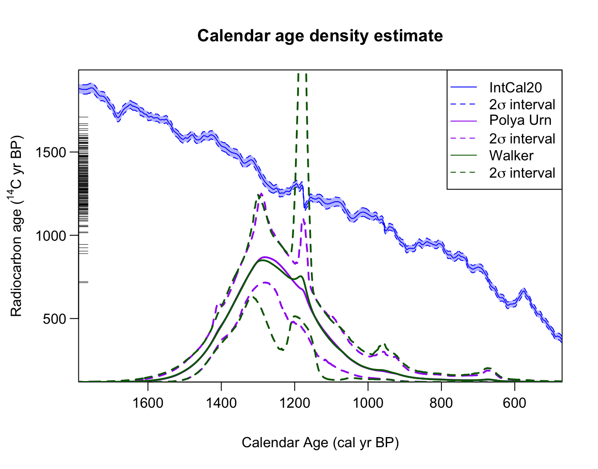
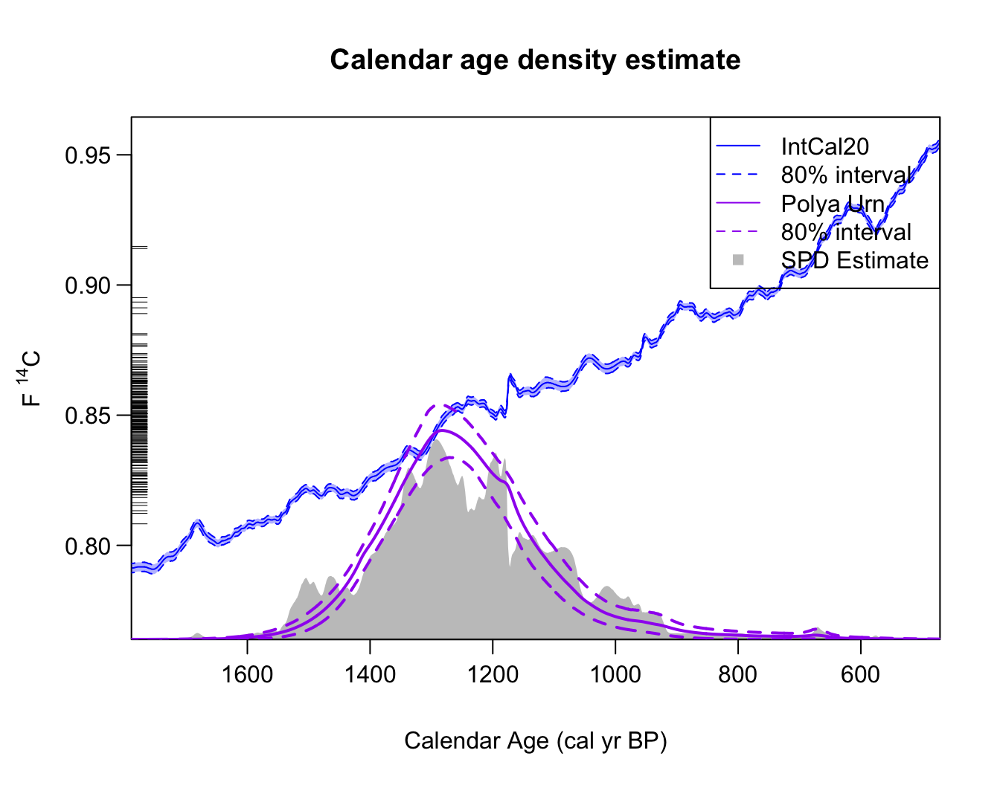
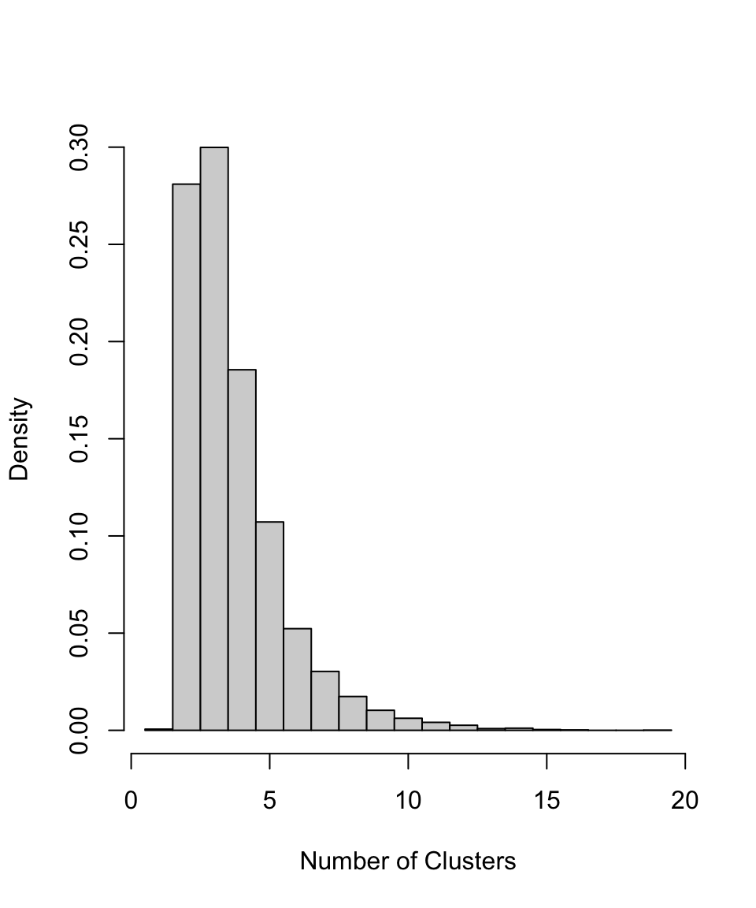
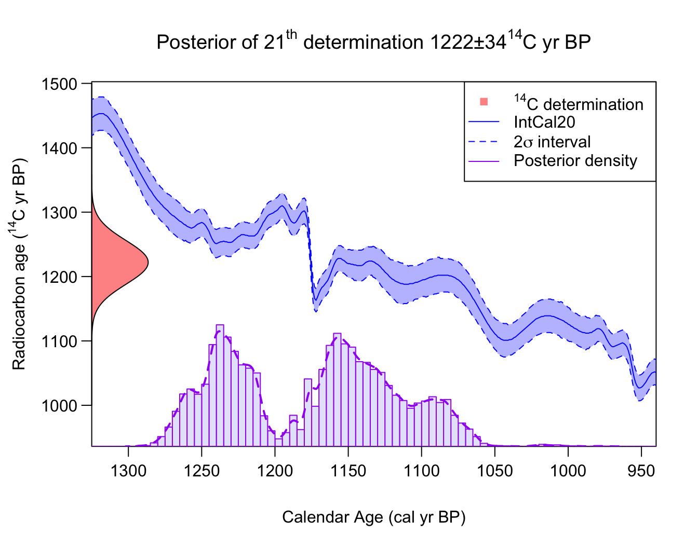
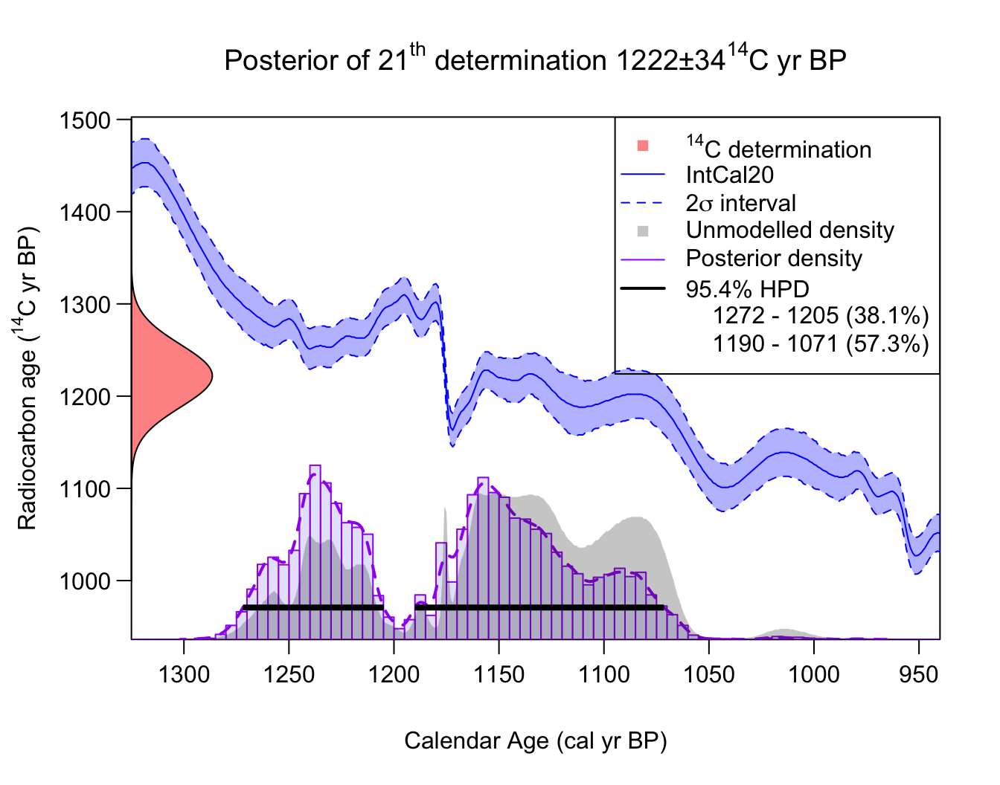
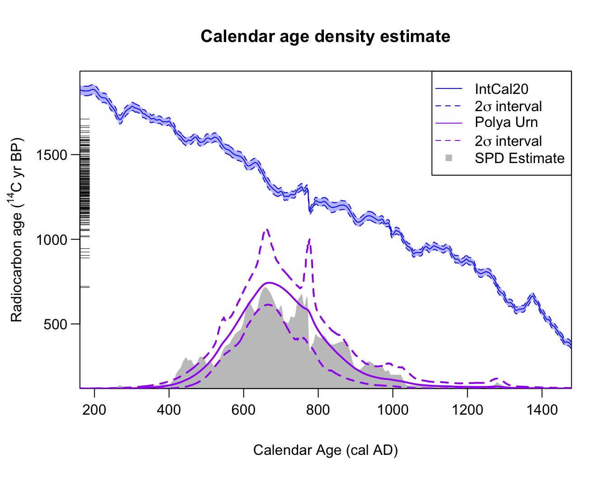
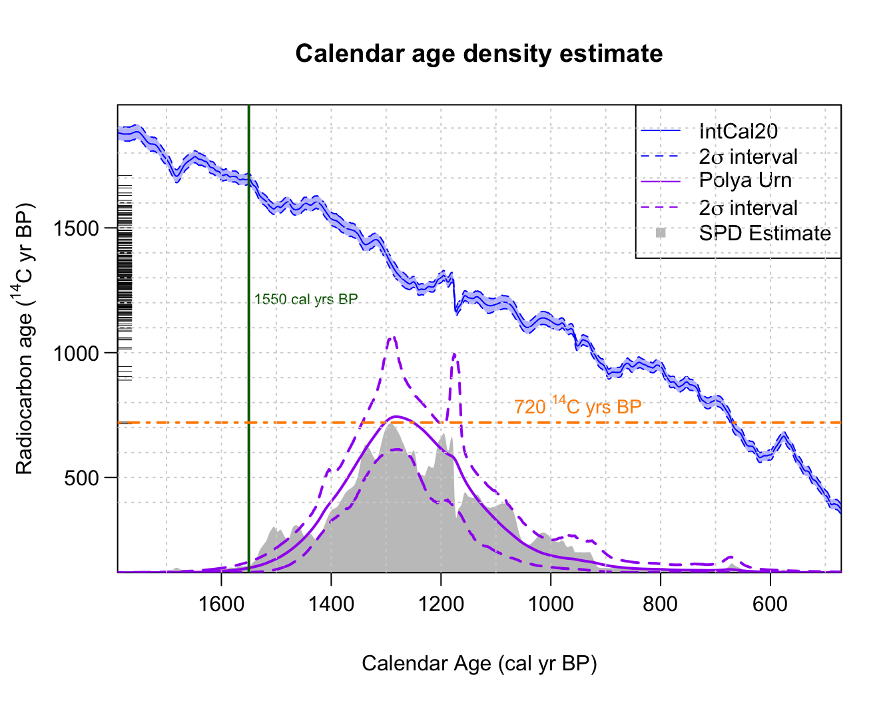

# Non-Parametric Calendar Age Summarisation

``` r

library(carbondate)
set.seed(5)
```

## Rigorous non-parametric summarisation of multiple ¹⁴C samples

### Model details

Suppose that we have a set of related ¹⁴C samples that have calendar
ages drawn from a shared, and unknown, calendar age density
$`f(\theta)`$. In summarising the calendar age information provided by
that set of samples, we are effectively seeking to estimate this
underlying density $`f(\theta)`$.

We model the underlying shared calendar age density $`f(\theta)`$ as an
infinite and unknown mixture of individual calendar age
*clusters/phases*:

``` math
f(\theta) = w_1 \textrm{Cluster}_1 + w_2 \textrm{Cluster}_2 + w_3 \textrm{Cluster}_3 + \ldots 
```

Each calendar age *cluster* in the mixture has a normal distribution
with a different location and spread (i.e., an unknown mean $`\mu_j`$
and precision $`\tau_j^2`$). Each object is then considered to have been
drawn from one of the (infinite) clusters that together constitute the
overall $`f(\theta)`$.

Such a model allows considerable flexibility in the estimation of the
joint calendar age density $`f(\theta)`$ — not only allowing us to build
simple mixtures but also approximate more complex distributions (see
illustration below). In some cases, this mix of normal densities may
represent true and distinct underlying normal archaeological phases, in
which case additional practical inference may be possible. However this
is not required for the method to provide good estimation of a wide
range of underlying $`f(\theta)`$ distributions.

The probability that a particular sample is drawn from a particular
cluster will depend upon the relative weight $`w_j`$ given to that
specific cluster. It will be more likely that an object will come from
some clusters than others. Given an object belongs to a particular
cluster, its prior calendar age will then be normally distributed with
the mean $`\mu_j`$ and precision $`\tau_j^2`$ of that cluster.


*An illustration of building up a potentially complex distribution
$`f(\theta)`$ using mixtures of normals. Left Panel: A simple mixture of
three (predominantly disjoint) normal clusters (blue dashed lines)
results in an overall $`f(\theta)`$ that is tri-modal (solid red). Right
Panel: Overlapping normal clusters (blue dashed lines) can however
create more complex $`f(\theta)`$ distributions (solid red).*

### Estimation of the shared underlying density

To estimate the shared calendar age density $`f(\theta)`$ based upon our
set of ¹⁴C observations, $`X_1, \ldots, X_N`$, we need to estimate:

- the mean $`\mu_j`$ and precision $`\tau_j^2`$ of each individual
  normal cluster within the overall mixture $`f(\theta)`$,
- the weighting $`w_j`$ associated to that cluster

This requires us to also calibrate the ¹⁴C determinations to obtain
their calendar ages $`\theta_1, \ldots, \theta_N`$. Since we assume that
the calendar ages of each object arise from the shared density, this
must be performed simultaneously to the estimation of $`f(\theta)`$.

We use Markov Chain Monte Carlo (MCMC) to iterate, for
$`k = 1, \ldots, M`$, between:

- Calibrate $`X_1, \ldots, X_n`$ to obtain calendar age estimates
  $`\theta_1^{k+1}, \ldots \theta_N^{k+1}`$ given current shared
  estimate that each $`\theta_i \sim \hat{f}^k(\theta)`$
- Update estimate of shared calendar age density (to obtain
  $`\hat{f}_{k+1}(\theta)`$ given current set of calendar ages
  $`\theta_1^{k+1}, \ldots \theta_N^{k+1}`$

After running the sampler for a large number of iterations (until we are
sufficiently confident that the MCMC has converged) we obtain estimates
for the calendar age $`\theta_i`$ of each sample, and an estimate for
the shared calendar age density $`\hat{f}(\theta)`$ from which they
arose. These latter estimates of the shared calendar age density are
called *predictive estimates*, i.e., they provide estimates of the
calendar age of a hypothetical new sample (based on the set of $`N`$
samples that we have observed).

Critically, with our Bayesian non-parametric method, the number of
calendar age clusters that are represented in the observed data is
unknown (and is allowed to vary in each MCMC step). This flexibility is
different, and offers a substantial advantage, from other methods that
require the number of clusters to be known *a priori*. For full
technical details of the models used, and explanation of the model
parameters, see Heaton (2022).

### Running the sampler

The MCMC updating is performed within an overall Gibbs MCMC scheme.
There are two different schemes provided to update the DPMM — a Polya
Urn approach (Neal 2000) which integrates out the mixing weights of each
cluster; and a slice sampling approach in which they are explicitly
retained (Walker 2007).

Run using the Polya Urn method (our recommended approach based upon
testing):

``` r

polya_urn_output <- PolyaUrnBivarDirichlet(
  rc_determinations = kerr$c14_age,
  rc_sigmas = kerr$c14_sig,
  calibration_curve = intcal20,
  n_iter = 1e5,
  n_thin = 5)
```

or the Walker method as follows:

``` r

walker_output <- WalkerBivarDirichlet(
  rc_determinations = kerr$c14_age,
  rc_sigmas = kerr$c14_sig,
  calibration_curve = intcal20,
  n_iter = 1e5,
  n_thin = 5)
```

**Note:** This example runs the MCMC for our default choice of 100,000
iterations. However, as we discuss below, for this challenging dataset
we need a greater number of iterations to be confident of convergence.
We always suggest running the MCMC for at least 100,000 iterations to
arrive at the converged results. However, for some complex datasets,
longer runs may be required. More detail on assessing convergence of the
MCMC can be found in the [determining convergence
vignette](https://tjheaton.github.io/carbondate/articles/determining-convergence.md)

Both of these methods will output a list containing the sampler outputs
at every $`n_{\textrm{thin}}`$ iteration, with the values of the model
parameters and the calendar ages.

### Obtaining the Summarised Calendar Age Information

Our sampler provides three outputs of particular interest.

#### Summarised Calendar Age Density Estimate

The calendar age information provided by the set of ¹⁴C samples is
summarised by calculating the predictive distribution for the calendar
age of a new, as yet undiscovered, object. This predictive density is
generated using the posterior sampled values of the DPMM component of
our MCMC sampler.

This summary (predictive) density can be calculated and plotted using
[`PlotPredictiveCalendarAgeDensity()`](https://tjheaton.github.io/carbondate/reference/PlotPredictiveCalendarAgeDensity.md).
The pointwise mean of $`\hat{f}(\theta)`$ will be plotted, together with
a corresponding interval at (a user-specified) probability level. If you
assign the function to a variable (as shown below) then the pointwise
mean and corresponding interval will also be stored and can be accessed.

The function allows calculation using multiple outputs so that their
results can be compared. For example, below we compare the results from
the two methods of MCMC sampling (the Polya Urn and slice sampling
approach).

``` r

# Run plotting function and assign output to DPMM_density_plot
DPMM_density_plot <- PlotPredictiveCalendarAgeDensity(
  output_data = list(polya_urn_output, walker_output),
  denscale = 2.5)
```



``` r


# DPMM_density_plot creates a list containing:
# 1 - predictive_density which stores the mean (and default 2 sigma intervals) 
# 2 - the plotting parameters (so you can edit/annotate the plot)

# To access the predictive density mean (and default 2 sigma intervals) for the two methods
DPMM_densities <- DPMM_density_plot$predictive_density

head(DPMM_densities[[1]]) # The Polya Urn estimate
#>   calendar_age_BP density_mean density_ci_lower density_ci_upper
#> 1             471 2.388155e-06     6.820028e-08     1.662975e-05
#> 2             472 2.414024e-06     6.850713e-08     1.674722e-05
#> 3             473 2.440255e-06     6.975724e-08     1.684074e-05
#> 4             474 2.466856e-06     7.089821e-08     1.690925e-05
#> 5             475 2.493833e-06     7.155962e-08     1.700700e-05
#> 6             476 2.521193e-06     7.237446e-08     1.711630e-05

head(DPMM_densities[[2]]) # The Walker estimate
#>   calendar_age_BP density_mean density_ci_lower density_ci_upper
#> 1             471 2.471499e-06     7.294953e-11     2.007406e-05
#> 2             472 2.488287e-06     7.431770e-11     2.007812e-05
#> 3             473 2.505414e-06     7.667058e-11     2.018940e-05
#> 4             474 2.522936e-06     7.858181e-11     2.051766e-05
#> 5             475 2.540896e-06     7.987301e-11     2.061738e-05
#> 6             476 2.559333e-06     8.491911e-11     2.079426e-05
```

We also have the option to plot the SPD, to plot in the F¹⁴C scale, and
to change the confidence intervals on the plot.

``` r

# Run plotting function and assign output to DPMM_density_plot
DPMM_density_plot <- PlotPredictiveCalendarAgeDensity(
  output_data = polya_urn_output,
  denscale = 2.5,
  show_SPD = TRUE,
  interval_width = "bespoke",
  bespoke_probability = 0.8,
  plot_14C_age = FALSE)
```



``` r


# Again we can access the actual predictive density
DPMM_densities <- DPMM_density_plot$predictive_density
head(DPMM_densities[[1]])
#>   calendar_age_BP density_mean density_ci_lower density_ci_upper
#> 1             471 2.417808e-06     1.828800e-07     6.463847e-06
#> 2             472 2.443581e-06     1.850626e-07     6.550466e-06
#> 3             473 2.469702e-06     1.872705e-07     6.598948e-06
#> 4             474 2.496178e-06     1.889666e-07     6.693827e-06
#> 5             475 2.523014e-06     1.904662e-07     6.738775e-06
#> 6             476 2.550217e-06     1.924577e-07     6.853425e-06
```

**Note:** The fact that the two different MCMC samplers do not provide
matching probability intervals should flag to us that we might not have
reached convergence, and need to run the MCMC for longer. Our
investigations generally showed that
[`PolyaUrnBivarDirichlet()`](https://tjheaton.github.io/carbondate/reference/PolyaUrnBivarDirichlet.md)
is better at reaching convergence, and so we recommend its use over
[`WalkerBivarDirichlet()`](https://tjheaton.github.io/carbondate/reference/WalkerBivarDirichlet.md).
A longer run of 1,000,000 iterations indicates that the plotted Polya
Urn output (in green) above is an accurate representation of the
predictive distribution.

Around 1176 cal yr BP, we see a substantial change between the 95%
intervals for the summarised (predictive) estimate of the joint
$`f(\theta)`$ (which have a large spike) and the 80% intervals (which do
not and are smooth). This is not an error, but rather highlights a
benefit of the DPMM method whereby the number of clusters needed to
represent the data is allowed to vary. This feature occurs because the
method is unsure if the observed data support an additional
(highly-concentrated) cluster located around this time period. In some
iterations of the MCMC, such a cluster will be included; but for the
majority of iterations, the method believes it is not required. Since
the plotted 80% interval does not contain the spike, but the 95% does,
it is likely that the method thinks there is a 2.5–10% chance of such a
distinct and highly-concentrated cluster (as this is the proportion of
the MCMC iterations containing one). If more detailed inference is
needed, one could look at the actual individual MCMC iterations to
estimate how likely such a highly-concentrated cluster, resulting in a
sudden spike in samples, is.

*Aside:* The sharp jump in the IntCal20 calibration curve at 1176 cal yr
BP (774 cal AD) is due to an extreme solar particle event (ESPE) also
known as a Miyake Event (Miyake et al. 2012).

#### Number of Clusters

The output data also contains information about the cluster allocation
of each sampled object, which we can use to build the probability for
there being a given number of total clusters. If we believe the
underlying individual clusters in the model have inherent meaning in
terms of representing genuine and distinct periods of site usage, as
opposed to simply providing a tool to enable a non-parametric density
estimate, this information may be archaeologically useful.

``` r

PlotNumberOfClusters(output_data = polya_urn_output)
```



#### Posterior Calendar Age Estimates of Individual Samples

The output data also includes the calendar age estimate for each ¹⁴C
sample. We can use this to determine the posterior distribution of the
calendar age for each sample. Note that the calendar age estimates use
the joint information provided by all the ¹⁴C determinations (as opposed
to solely the ¹⁴C determination of the single object that would be found
using
[`CalibrateSingleDetermination()`](https://tjheaton.github.io/carbondate/reference/CalibrateSingleDetermination.md))
on the understanding the calendar ages of the objects are related.

You can calculate and plot this using
[`PlotCalendarAgeDensityIndividualSample()`](https://tjheaton.github.io/carbondate/reference/PlotCalendarAgeDensityIndividualSample.md) -
for example to calculate the posterior calendar age distribution for the
21st ¹⁴C determination:

``` r

PlotCalendarAgeDensityIndividualSample(21, polya_urn_output)
```



The highest posterior density range for a given probability and the
unmodelled density (i.e., the result of
[`CalibrateSingleDetermination()`](https://tjheaton.github.io/carbondate/reference/CalibrateSingleDetermination.md))
can also be shown on the plot by specifying this in the arguments, as
shown below.

``` r

PlotCalendarAgeDensityIndividualSample(
  21, polya_urn_output, show_hpd_ranges = TRUE, show_unmodelled_density = TRUE)
```



### Changing the calendar age plotting scale

For those plotting functions which present calendar ages (i.e.,
[`PlotCalendarAgeDensityIndividualSample()`](https://tjheaton.github.io/carbondate/reference/PlotCalendarAgeDensityIndividualSample.md)
and
[`PlotPredictiveCalendarAgeDensity()`](https://tjheaton.github.io/carbondate/reference/PlotPredictiveCalendarAgeDensity.md))
we can change the calendar age scale shown on the x-axis. The default is
to plot on the *cal yr BP* scale (as in the examples above). To instead
plot in *cal AD*, set `plot_cal_age_scale = "AD"`; while for *cal BC*,
set `plot_cal_age_scale = "BC"`, e.g.,

``` r

DPMM_density_plot <- PlotPredictiveCalendarAgeDensity(
  output_data = polya_urn_output,
  show_SPD = TRUE,
  plot_cal_age_scale = "AD")
```



### Annotating the summary density plots with text, lines and shading

We have created three functions:

- [`AddLinePlot()`](https://tjheaton.github.io/carbondate/reference/AddLinePlot.md) -
  adds lines (vertical or horizontal)
- [`AddTextPlot()`](https://tjheaton.github.io/carbondate/reference/AddTextPlot.md) -
  adds text
- [`AddShadingPlot()`](https://tjheaton.github.io/carbondate/reference/AddShadingPlot.md) -
  adds shading

that allow you to annotate the plot showing the predictive (summary)
calendar age distribution. For example:

``` r

# Run the plotting function and assign output to DPMM_density_plot
DPMM_density_plot <- PlotPredictiveCalendarAgeDensity(
  output_data = polya_urn_output,
  show_SPD = TRUE)

# Add solid vertical line at 1550 cal yr BP
AddLinePlot(DPMM_density_plot,
  v = 1550,
  col = "darkgreen",
  lwd = 2,
  lty = 1)

AddTextPlot(DPMM_density_plot,
  x = 1550, y = 1200,
  labels = expression(paste("1550 cal yrs BP")),
  cex = 0.7,
  pos = 4, # Places the text to the right
  offset = 0.2,
  col = "darkgreen")

# Add a dashed horizontal line at 720 14C yrs BP
AddLinePlot(DPMM_density_plot,
  h = 720,
  col = "darkorange",
  lwd = 2,
  lty = 4)
    
AddTextPlot(DPMM_density_plot,
  x = 950, y = 720,
  labels = expression(paste("720", " "^14, "C ", "yrs BP")),
  cex = 0.9,
  pos = 3, # Places text above 
  offset = 0.2,
  col = "darkorange")

# Add light gray grid lines to entire plot
AddLinePlot(DPMM_density_plot,
  h = seq(400, 2000, by = 100),
  v = seq(200, 2000, by = 100),
  col = "lightgray",
  lty = 3)
```


See the [independent calibration
vignette](https://tjheaton.github.io/carbondate/articles/Independent-calibration.md)
for more examples of ways to annotate the summary plot.

### When not to use this Bayesian non-parametric method

The current implementation of our Bayesian non-parametric approach
**only** supports normally-distributed clusters as the components in the
overall calendar age mixture distribution $`f(\theta)`$. While this
still allows a great deal of flexibility in the modelling, as many
distributions can be well approximated by normals, there are certain
distributions $`f(\theta)`$ for which they will struggle. In particular,
you cannot approximate a uniform phase well with a mixture of normal
distributions.

If the underlying shared calendar age density $`f(\theta)`$ is close to
a uniform phase, or a mixture of uniform phases, then the current
(normally-distributed cluster component) Bayesian non-parametric method
is unlikely to work optimally and provide reliable summaries. In such
cases, we advise use of
[`PPcalibrate()`](https://tjheaton.github.io/carbondate/reference/PPcalibrate.md).
This alternative approach is ideally suited to such situations.

The inhomogeneous Poisson process/changepoint approach taken by
[`PPcalibrate()`](https://tjheaton.github.io/carbondate/reference/PPcalibrate.md)
implicitly assumes a shared underlying calendar age model for
$`f(\theta)`$ that consists precisely of an unknown mixture of uniform
phases. Implementing
[`PPcalibrate()`](https://tjheaton.github.io/carbondate/reference/PPcalibrate.md)
and plotting the posterior rate of the Poisson process ([see
vignette](https://tjheaton.github.io/carbondate/articles/Poisson-process-modelling.md))
will provide an estimate of that shared calendar age density.

In general, we would suggest that users might apply both this Bayesian
non-parametric DPMM and the Poisson process approach and compare outputs
as part of the research process.

## References

Heaton, Timothy J. 2022. “Non-parametric Calibration of Multiple Related
Radiocarbon Determinations and their Calendar Age Summarisation.”
*Journal of the Royal Statistical Society Series C: Applied Statistics*
71 (5): 1918–56. <https://doi.org/10.1111/rssc.12599>.

Miyake, Fusa, Kentaro Nagaya, Kimiaki Masuda, and Toshio Nakamura. 2012.
“A signature of cosmic-ray increase in AD 774–775 from tree rings in
Japan.” *Nature* 486 (7402): 240–42.
<https://doi.org/10.1038/nature11123>.

Neal, Radford M. 2000. “Markov Chain Sampling Methods for Dirichlet
Process Mixture Models.” *Journal of Computational and Graphical
Statistics* 9 (2): 249. <https://doi.org/10.2307/1390653>.

Walker, Stephen G. 2007. “Sampling the Dirichlet Mixture Model with
Slices.” *Communications in Statistics - Simulation and Computation* 36
(1): 45–54. <https://doi.org/10.1080/03610910601096262>.
