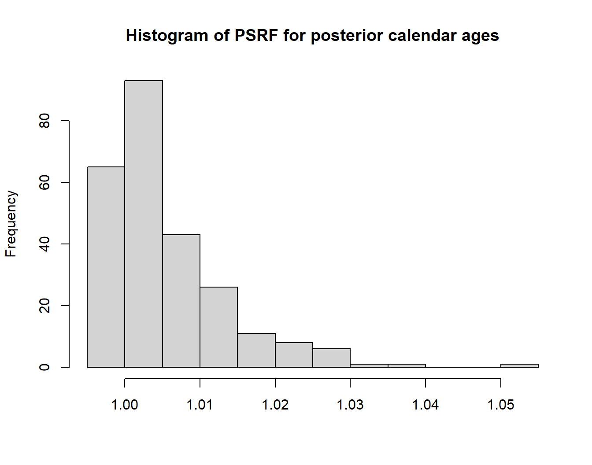
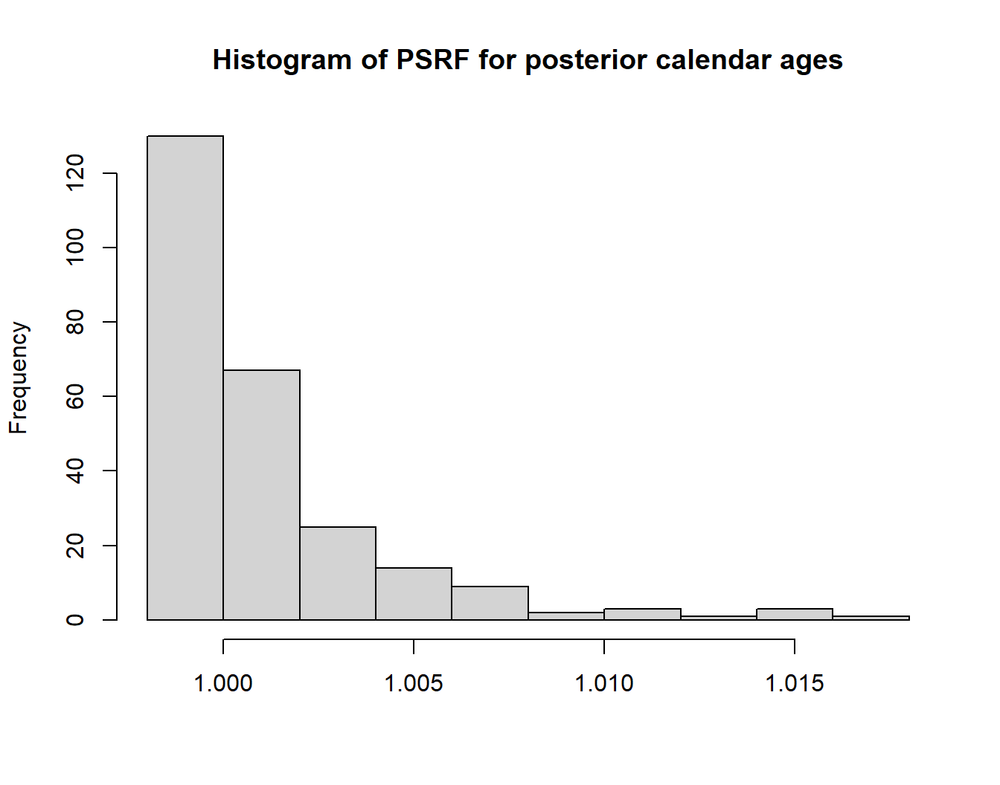
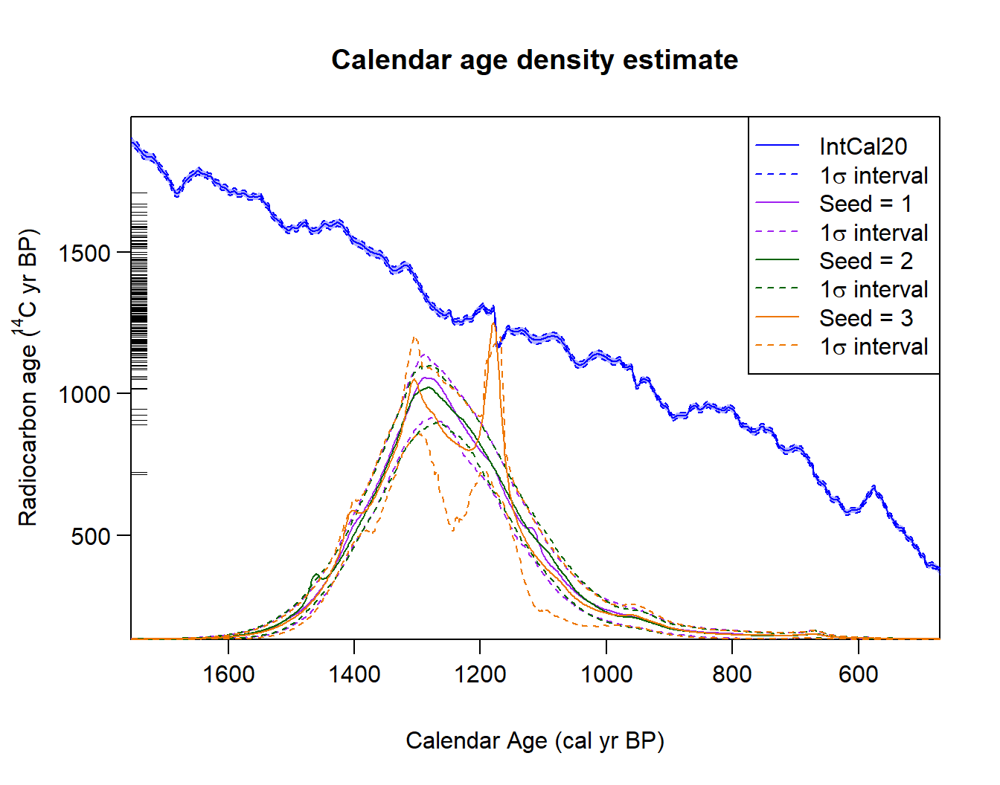
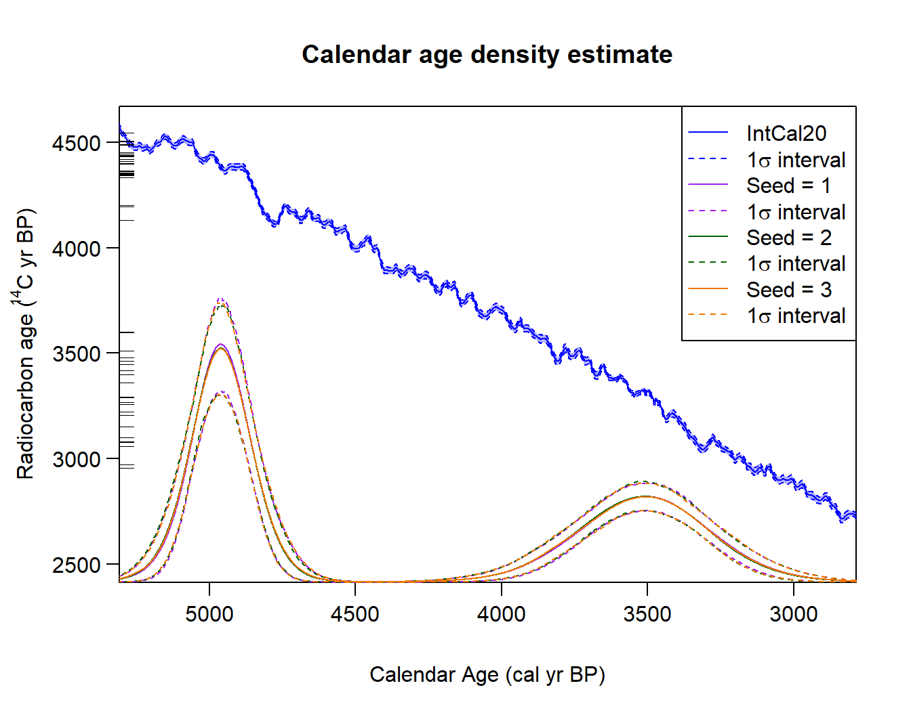
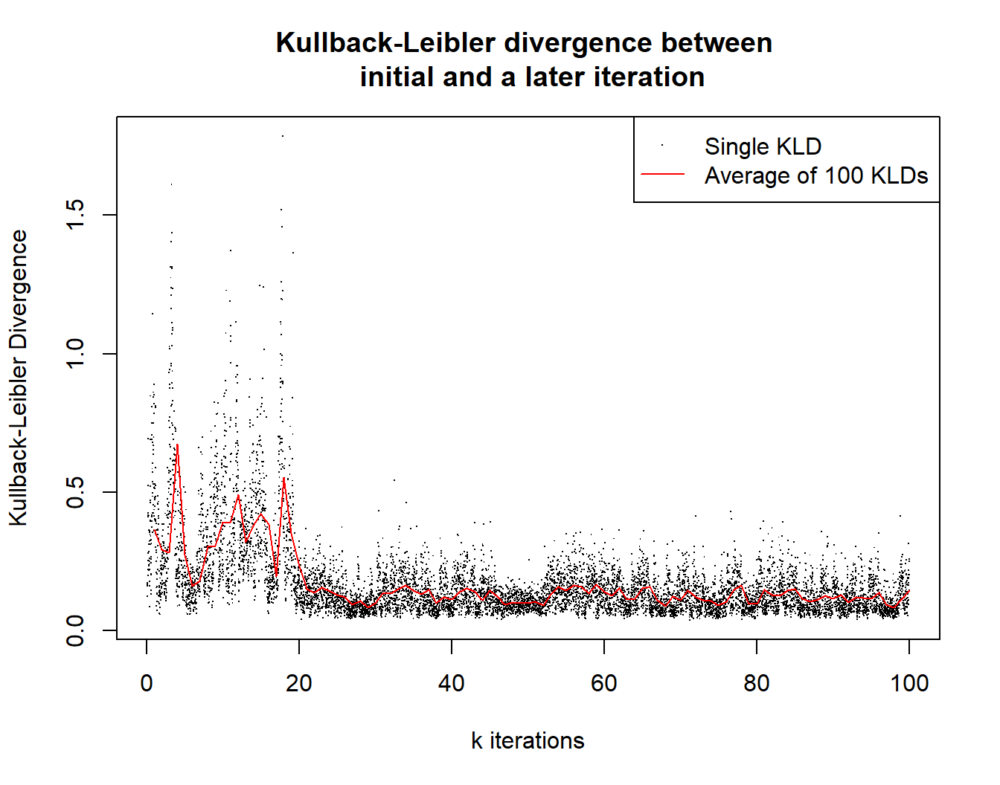

# Determining Convergence

``` r

library(carbondate)
```

## Introduction

A few tools to determine how well the MCMC for the various approaches
have converged.

### Examining the Gelman-Rubin convergence diagnostic

This is often used to evaluate MCMC convergence. It compares the
*between-chains* variance with the *within-chains* variance of the model
parameters for multiple MCMC chains. If the MCMC has converged to the
target posterior, then these values should be similar. To assess
convergence of our methods, we apply it to the individual posterior
calendar age estimates of the ¹⁴C samples. We have $`N`$ such samples,
each of which has a individual sequence of sampled calendar age values
that are stored within the overall MCMC. We calculate the potential
scale reduction factor (PSRF) for each individual sample’s calendar age
sequence, generating $`N`$ PSRF values. If the MCMC has converged to the
target posterior distribution, then each of these PSRFs should be close
to 1.

In the first case, the relevant MCMC function can be run multiple times.
This generate different chains.

``` r

all_outputs <- list()
for (i in 1:3) {
  set.seed(i + 1)
  all_outputs[[i]] <- PolyaUrnBivarDirichlet(
      kerr$c14_age, kerr$c14_sig, intcal20, n_iter = 1e4)
}
PlotGelmanRubinDiagnosticMultiChain(all_outputs)
```



It can also be calculated by taking a single MCMC run, and splitting it
into multiple parts to compare the *within-segment* variance with the
*between-segment* variance for each calendar age observation.

``` r

set.seed(3)
output <- PolyaUrnBivarDirichlet(
    kerr$c14_age, kerr$c14_sig, intcal20, n_iter = 2e4)

PlotGelmanRubinDiagnosticSingleChain(output, n_burn = 5e3)
```



As you can see, even with a few iterations (where we would expect the
result not to have converged yet) the PSRF values are close to one.

### Examining the predictive distribution or posterior occurrence rate

When calibrating multiple ¹⁴C determinations, primary interest will
frequently be in the summarised (predictive) calendar age estimate if
using the Bayesian non-parametric method, or the posterior occurrence
rate if using the Poisson process approach, rather than the age of any
individual sample. Information on the predictive estimate is
encapsulated in the model parameters relating to the underlying clusters
(e.g., weights and distributions). While the occurrence rate is defined
by the locations of the changepoints, and the segment heights, in the
Poisson process model.

Unfortunately, the chains storing these parameters are not suitable for
the Gelman-Rubin diagnostic. In the case of the predictive Bayesian
non-parametric estimate, the number and identity of the clusters stored
in the MCMC can change with each iteration (as clusters drop-in and out,
or are relabelled). In the case of the Poisson process occurrence rate,
the number and labelling of changepoints varies throughout the MCMC. We
therefore provide a further diagnostic, based upon assessing the
predictive calendar age estimate or posterior occurrence rate, which may
be a much more useful indicator of MCMC convergence.

#### Visually comparing multiple runs

Running the functions a few time with different random number seeds can
give an idea of how many iterations are needed for convergence. If the
MCMC has converged, then each run should lead to a similar result for
the predictive density (or the posterior occurrence rate in the case of
the POisson process model). For example,

``` r

outputs <- list()
for (i in 1:3) {
  set.seed(i+1)
  outputs[[i]] <- PolyaUrnBivarDirichlet(
      rc_determinations = kerr$c14_age,
      rc_sigmas = kerr$c14_sig,
      calibration_curve=intcal20,
      n_iter = 1e4)
  outputs[[i]]$label <- paste("Seed =", i)
}
PlotPredictiveCalendarAgeDensity(
  outputs, n_posterior_samples = 500, denscale = 2, interval_width = "1sigma")
```



As you can see, in this case (255 determinations collated by Kerr and
McCormick (Kerr and McCormick 2014)) the different runs do not have
similar outputs, so more iterations would be needed to ensure
convergence.

In contrast, if we run a much simpler example (that of artificial data
comprised of two normals), we can see that convergence appears to be
achieved in a small number of iterations.

``` r

outputs <- list()
for (i in 1:3) {
  set.seed(i + 1)
  outputs[[i]] <- PolyaUrnBivarDirichlet(
  rc_determinations = two_normals$c14_age,
  rc_sigmas = two_normals$c14_sig,
  calibration_curve=intcal20,
  n_iter = 1e4)
  outputs[[i]]$label <- paste("Seed =", i)
}
PlotPredictiveCalendarAgeDensity(
  outputs, n_posterior_samples = 500, denscale = 2, interval_width = "1sigma")
```



This approach to assessing convergence can be taken with either the
Bayesian non-parametric method, or the Poisson process modelling.

#### Examining the Kullback–Leibler divergence (Bayesian non-parametrics only)

We also provide a further diagnostic specifically for the Bayesian
non-parametric approach (it is not applicable for the Poisson process
model). This diagnostic gives a measure of the difference between an
initial (baseline) predictive density and the predictive density as the
MCMC progresses.

``` r

set.seed(50)
output <- WalkerBivarDirichlet(
    rc_determinations = kerr$c14_age,
    rc_sigmas = kerr$c14_sig,
    calibration_curve=intcal20,
    n_iter = 1e5)

PlotConvergenceData(output)
```



It can give an idea of convergence as well as which iteration number to
use for `n_burn` when calculating the predictive density (by default set
to half the chain).

## References

Kerr, T. R., and F. McCormick. 2014. “Statistics, Sunspots and
Settlement: Influences on Sum of Probability Curves.” *Journal of
Archaeological Science* 41 (January): 493–501.
<https://doi.org/10.1016/j.jas.2013.09.002>.
